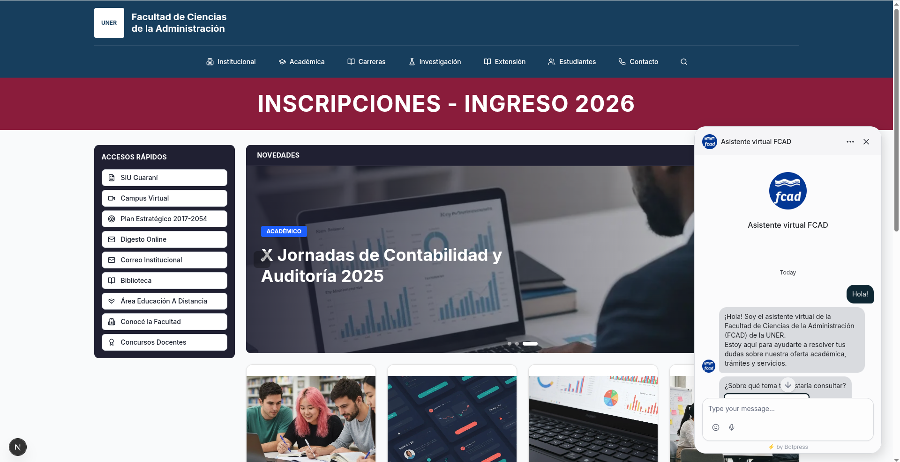
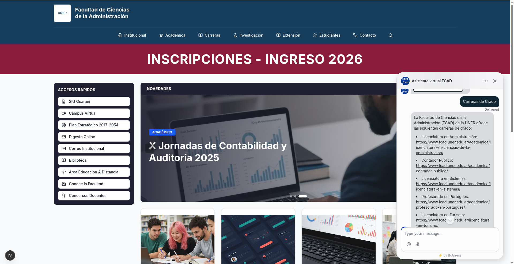
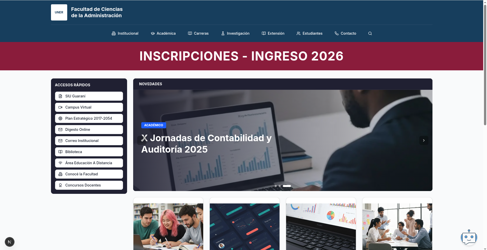

# FCAD Bot · Clon web institucional + base para asistente virtual

Aplicación web desarrollada con Next.js que recrea la estética y la experiencia de navegación de la **Facultad de Ciencias de la Administración (UNER)**, incorporando una arquitectura lista para extenderse con un chatbot académico.

---

## Qué resuelve este proyecto

- Replica una portada institucional moderna para entorno universitario.
- Organiza contenido académico y administrativo de forma clara y navegable.
- Presenta una base técnica lista para integrar un asistente virtual (Botpress) en siguientes iteraciones.

---

## Funcionalidades actuales

- **Header institucional** con navegación principal por áreas.
- **Banner destacado** para campañas de ingreso (ej. Ingreso 2026).
- **Sidebar de accesos rápidos** con accesos frecuentes para estudiantes.
- **Carrusel de novedades** con rotación automática y navegación manual.
- **Grid de contenidos** con cards informativas y diseño responsive.
- **Analítica de uso** integrada con Vercel Analytics.

---

## Capturas

### Home + chatbot abierto



### Chatbot respondiendo consulta



### Home con chatbot minimizado



---

## Stack tecnológico

### Core

- **Next.js 15** (App Router)
- **React 19**
- **TypeScript**

### UI / Diseño

- **Tailwind CSS v4**
- **Radix UI** (primitivas accesibles)
- **shadcn/ui** (componentes base)
- **Lucide React** (iconografía)

### Integración y utilidades

- **@vercel/analytics**
- **Botpress Webchat** (integración por script embebido)

---

## Arquitectura resumida

La página principal se compone de módulos reutilizables:

- `app/page.tsx`: orquesta la home y layout visual general.
- `components/header.tsx`: identidad + navegación superior.
- `components/quick-access.tsx`: barra lateral de enlaces rápidos.
- `components/hero-carousel.tsx`: bloque dinámico de novedades.
- `components/content-grid.tsx`: tarjetas de noticias/eventos.
- `components/ui/*`: librería de componentes base reutilizable.

---

## Cómo ejecutarlo localmente

### Requisitos

- Node.js 20+
- pnpm 9+

### Instalación

```bash
pnpm install
```

### Configuración del chatbot (Botpress)

El chatbot se integra desde scripts en `app/layout.tsx`.

### Modo desarrollo

```bash
pnpm dev
```

Alternativa con npm:

```bash
npm run dev
```

Abrir en: `http://localhost:3000`

### Build de producción

```bash
pnpm build
pnpm start
```

---

## Scripts disponibles

- `pnpm dev`: inicia servidor de desarrollo con Turbopack.
- `pnpm build`: genera build de producción con Turbopack.
- `pnpm start`: levanta la build en modo producción.

---

## Estructura del proyecto

```text
fcad-bot/
├── app/
│   ├── globals.css
│   ├── layout.tsx
│   └── page.tsx
├── components/
│   ├── content-grid.tsx
│   ├── header.tsx
│   ├── hero-carousel.tsx
│   ├── quick-access.tsx
│   └── ui/
├── lib/
├── public/
├── next.config.ts
├── package.json
└── tsconfig.json
```

---

### Implementado

- Diseño institucional responsive.
- Componentización por bloques.
- Base sólida de UI para crecimiento.
- Chatbot Botpress integrado mediante script oficial embebido.

---
